# Sneaker Central

## Milestone Project 4 - Full Stack Frameworks with Django

Website live link - https://sneakercentral.herokuapp.com/ 

Github link - https://github.com/AndrewDarwin/sneaker_central

Sneaker Central is a full-stack e-commerce site based around business logic designed for users to purchase sneakers from the store. The application’s purpose to create a web shop to sell sneakers. The value it provides to users is to offer them a selection of sneakers in a simple, easy to use interface and a secure check-out to purchase them.

# 1. User experience (UX)

## UX - Five UX Planes

## Strategy

### Project goals

* Creating a full-stack site based around business logic used to control a centrally-owned database.

* Creating a site that provides an authentication mechanism and provides paid access to the site’s data based on the dataset.

* Creating a full-stack site that uses HTML, CSS, JavaScript, Python + Django.

* Creating a site that uses a relational database

* Creating a site that uses Stripe payments

### Business goals

* Creating a secure and professional e-commerce website.

* Provide users inspiration for different sneakers.

* Makes profit with selling sneakers.

### Visitor goals

* Be inspired to purchase sneakers from the site.

* Safely purchase sneakers on the web shop.

### Target audience

* Everyone who loves sneakers.

* People who are looking to purchase sneakers

## User stories

### Visitor goals:

* As a visitor, I want to be able to easily navigate through the site on any size screen

* As a visitor, I want to know about the company:

* As a visitor, I want to see an overview of all of the sneakers available, so I can see what the website is offering

* As a visitor, I want to have the ability to sort products by price/rating/category

* As a visitor, I want to be able to search for different sneakers, so I can find specific sneakers quick and easy

* As a visitor, I want to be able to view details about the sneakers (size, price, image, description), so I can see if the product suits my preferences

### Consumer goals:

* As a consumer, I want to add products to my basket, so I can buy products

* As a consumer, I want to be able purchase products without an account

* As a consumer, I want to be able to delete products in my order, so I can remove products that I no longer wish to purchase

* As a consumer, I want to see the total price and shipping costs of my order, so I can see how much I have spent in total

* As a consumer, I want to pay with a card in a safe and secure way, so I know that my payment goes well

* As a consumer, I want to receive a confirmation email of the order, so I know that the order is successfully received

* As a consumer, I want to create an account, so I can see my profile details and order history

### Returning consumer goals:

* As a returning consumer, I want to securely login into my account quickly, so I can make an order quickly and so I can see my order history

* As a returning consumer, I want to purchase products and have my order(s) saved to my profile

* As a returning consumer, I want to be able to view my past orders and order confirmations

* As a returning consumer, I want to be able to leave reviews of products

### Site Owner/Admin goals:

* As admin, I want to provide a clean, simple e-commerce store so that users can easily find what they’re looking for

* As admin, I want to have the ability to add, edit/update and delete products

* As admin, I want to keep the site secure by only allowing authorised users to access certain areas of the site

* As admin, I was to securely store user information in case an error occurs

## Scope

Sneaker Central's scope centres around a clear and fully responsive site design and navigation - for ease of use there's a Navigation bar which is simple to navigate, as well as a search Function. There are detailed product pages, a working and secure payment system, secure authorisation, a profile page and full admin access. 

## Structure

Sneaker Central’s home page includes a hero image of a pair of feet wearing Nike sneakers jumping into a puddle in a street, and a large “Shop Now” button to encourage users to purchase sneakers. The Nav bar has links to the various products on the site. In the footer, there’s an ‘About Sneaker Central” section that overviews what the site is about.

### Products;

* add_product.html - contains a form to add a product. Only the admin has access to this page.

* edit_product.html - allows the admin to edit an existing product.

* product_detail.html - displays the Product detail page to the user, such as product name, image, description, price, size and quantity options. The user is also given the option to add this product to their shopping bag in their size and quantity of choice.

* products.html - displays a list of Products that are available to purchase to the user.

### Shopping Bag;

* bag.html, users can view their shopping bag contents here, make changes to quantities of products and continue securely to the checkout page.

### Checkout;

* checkout.html - the final checkout page is displayed to the user. They can view their order via a summary, and complete a form with their personal details on so they can have the product/s delivered to them. This is where they will be asked to input their payment information, and once the “Complete Order” button has been clicked, payment will be taken and the order processed. A warning note “your card will be charged (amount)” is placed below this button to warn users of this.

* checkout_success.html - a confirmation page, and one that will be shown to the user upon successful completion of an order. Here will be the order confirmation summary, with all of the details of the order and the personal details the user put in on the page prior.

### Profiles;

* profile.html - Displays the users profile to the user. Contains their saved personal details and order history. Only accessible by someone who is registered to the site.

## Skeleton

### Wireframes

Here below are some wireframes I created for Sneaker Central;

### Home

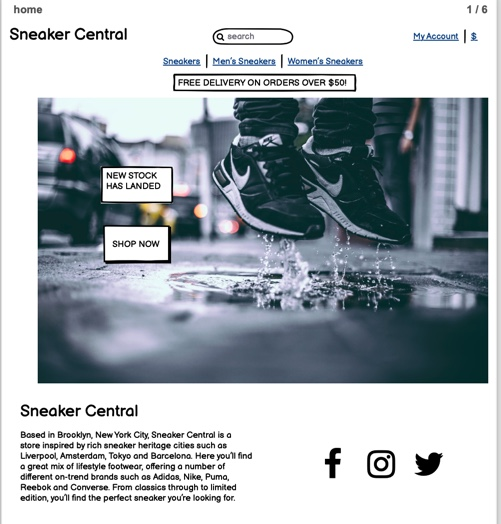

### Products

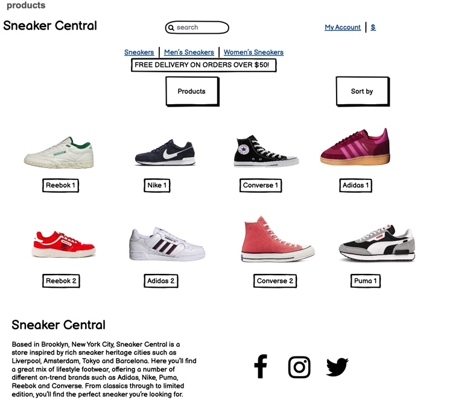

### Product

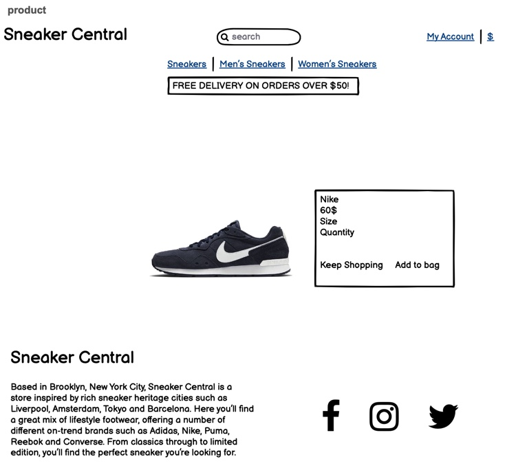

### Shopping Bag

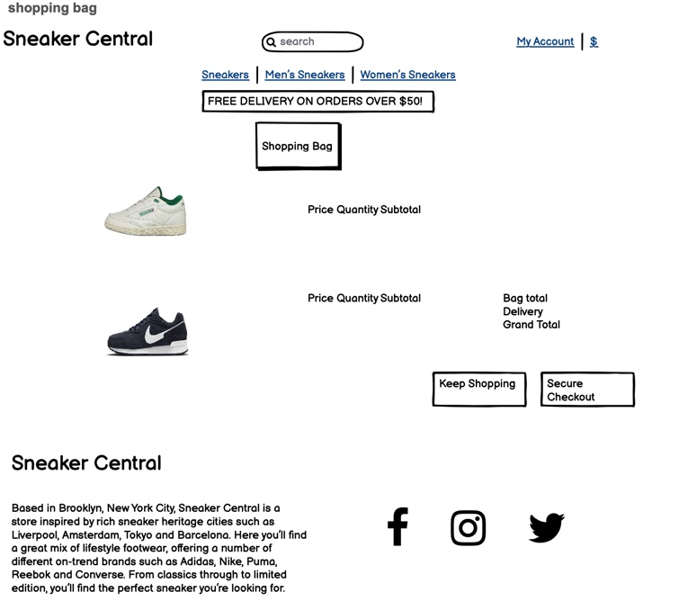

### Checkout

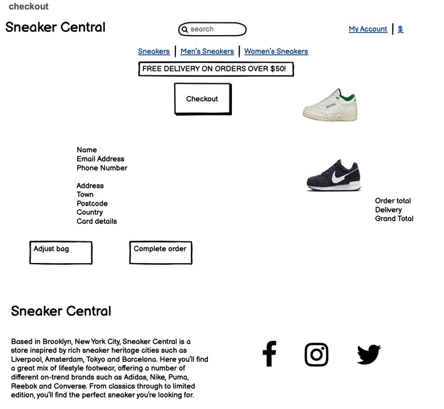

### Order Confirmation

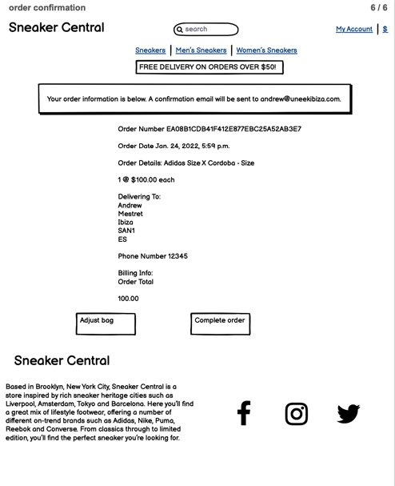

## Surface

### Colours

As there’s a lot of colour on the site in terms of the product images of the sneakers, I decided that the images would provide the main colour to the site. So the only 2 colours I used in design were white and black. I wanted the site to have a simple, clean, fresh feel and be easy to view/navigate, so in my opinion these 2 colours were perfect for that. 

* White - This was the background colour used for all of my pages. I didn't want any other colours as it would have detracted from the bright colours of the product images.

* Black - I used black as the colour of the text. As I had a white background I chose black to stand out the most.

### Images

Using imagery is really important on websites as it allows the user to understand visually what the theme of the site is, and see exactly what is going on. Users also need to see images of the products they are searching for so they can make informed choices on what products suit their needs the most. Other than the product images, there is 1 main hero image on the home page - that of a person in a pair of sneakers (only the sneakers are viewable for emphasis on them - the main purpose of the site) - this image fits well with the text of the home page “Welcome To Sneaker Central” - the sneakers are in motion of landing on to the floor of the street, so I think it all fits together well. 

### Typography 

I have used the tahoma font on the site, as I think it’s a beautiful and unique font that really fits well with the background and general theme of the site, making it look professional. 

# 2. Features

## Current Features

### All/Multiple Page Features

* Responsiveness - The site is fully responsive, regardless of device type and screen size.

* Navbar & Footer - The Navbar and Footers are the same across all pages. The top navbar has the site logo, a working search bar, an account dropdown and a link to the shopping bag. The footer consists of a brief overview of what the site is, and links to social media sites. Both the navbar and the footer make use of icons taken from Font Awesome.

* Messages/Toasts - Messages and Toasts are used when executing certain actions on the site, such as logging in and out, adding and removing products from the shopping bag, completing a transaction, and for admin actions too like adding and editing products.

* Buttons - Buttons are used throughout the site to choose certain options, confirm choices etc.

### Page Specific Features

### Products

* Products are displayed in a responsive format

* Filtering options to sort products by price, name, category, price.

* Product info is displayed to the user such as the product image, name, price, category link, and for admins, edit/delete buttons

* Users can click on the product images which will take them to the product details page for that particular product

### Product Detail

* Product details shown to user; image, name, price, edit/delete buttons for admins and description

* Size selector

* Quantity selector that allows the user to choose the quantity they would like to purchase

* Keep Shopping button that takes the user back to the products page

* Add To Bag button that adds the product to the users shopping bag

### Shopping Bag

* Shows the user the product/s that they have in their bag

* Displays product image, name, size, SKU, price 

* Quantity selector allows user to see how many they have in their shopping bag and amend that amount

* Subtotal shows the cost of the product, reflects changes upon quantity amendments

* Bag total, delivery and grand total show these amounts to the user

* Keep Shopping button allows the user to navigate back to the products page

* Secure Checkout buttons takes the customer to the Checkout page

### Checkout

* Order summary that shows the product info that the user will be purchasing

* Delivery form that allows users to input a name, email address and their delivery details

* Payment input using Stripe

* Adjust Bag button that takes the user back to the shopping bag so they can amend their order

* Complete Order button that allows the user to process their order. This processes their payment method and completes the order

* Text warning alerting the user that payment WILL be taken upon completing their order

### Checkout Success/Order History

* Order details provided to the user including products ordered, costs and delivery details

* Button at the bottom of the screen showing an option to either navigate back to products page or back to the users profile depending on whether the user completed a new order, or viewed a previous order from the profile screen

### Register/Log In

* Allows the user to register for an account using their email address

* Allows the user to log in using their username

### Profile

* Shows the users default delivery information and allows them to update it freely

* Order History section allows users to see an overview of past orders, and if they click on the order number it takes them to the Order History page

### Add Products – Admin Only

* Crispy form is used to generate the form for adding a product

* Allows the admin to enter necessary details of the product

* Option to add an image to the product

### Edit Products – Admin Only

* Generates a crispy form with the current product information already input

* Allows the admin to edit the form as necessary

* Option to remove and add an image to the product

# 3. Technologies Used

## Languages

* HTML5

* CSS3

* JavaScript

* Python3

## Tools and programmes

* Django - Used as the main framework

* Bootstrap 5 - Used for the responsive layout and various classes

* Google Fonts - Used for the fonts on the site

* Font Awesome - Used for Icons that are displayed throughout the site

* Stripe - Used for card payments

* GitHub - Used for storing the project files

* GitPod - Used as the IDE for my project

* Balsamiq for making the wireframes.

* Chrome Developer Tools to debug and checking/testing the website.

* PostgreSQL used as an open source relational cloud database during development.

* Amazon AWS used to store static files after deployment.

* Heroku a cloud platform for deploying the website.

* W3C Markup Validation Service to check for markup validity.

* W3C CSS Validation Service to check the CSS-code.

* JSHint to check the Javascript code.

* PEP8 checker to check the python code for PEP8 requirements.

* Gmail - Send users confirmation emails

* Gunicorn - Gunicorn ‘Green Unicorn’ is a Python WSGI HTTP Server for UNIX. The Gunicorn server is broadly compatible with various web frameworks, simply implemented, light on server resources, and speedy.

* Pillow - The Python Imaging Library adds image processing capabilities to your Python interpreter. This library provides extensive file format support, an efficient internal representation, and powerful image processing capabilities

* boto3 - Boto is the Amazon Web Services (AWS) SDK for Python. It enables Python developers to create, configure, and manage AWS services, such as EC2 and S3.

# 4. Testing

## Functionality

### Security Testing

All pages were tested with a non-admin account to make sure that no access was given to those users that should not have access. This was tested by me copying the links, accessing them on an incognito browser in Google Chrome that I was not logged into, then logging into it with a non-admin user, and trying the links again. The error pops up correctly and advises the user that only admins and site owners can view that page.

### Responsiveness

The responsiveness of the site was tested across a mixture of desktop, and mobile devices. I found no issues with any elements of the site when testing this.

### General Functionality Testing

### Navbar

* Navbar is positioned at the top of the screen, and is fixed so that it is visible even when the user has scrolled down the page

* All links have been tested and navigate to the correct area of the site

* Dropdown hover colours are all correct and links work

* Navbar correctly collapses on smaller screens including mobile view.

* Overall collapsed layout is consistent with rest of the site

* Search bar toggle works correctly

* Site Logo displays on mobile view and is correctly hidden when on larger screens

### Navbar Search Bar

* Focus and hover colours work correctly

* When searching for a product on the site, it brings up all relevant products. 

* All correct alerts and errors are shown based on search query

### Footer

* Footer is fixed to the bottom of all content

* Social Links open a new tab and take the user to the correct site

### Home

* Image and text/button overlays are nicely responsive on desktop and mobile views

* Buttons work correctly and navigate the user to the correct pages. They also position correctly depending on screen size

* Featured Brands pages work correctly, and all products that are under that brand are displayed when the option is clicked. 

### Products

* Correct titles are displayed when the categories are selected

* Correct sub-category buttons are displayed under each main category, and when the sub-category has been selected, the correct button shows

* All button effects including hover have been fully tested and work correctly

* Sort By option dropdown works correctly and I have tested all options to make sure the order of products changed depending on the criteria

* Category tag links, and edit/delete links for admins all work as intended

* When the image is clicked, the user is taken to that product’s individual detail page. All products work

### Product Detail

* Product images are all correct, and should a product not have an image, the correct default image is displayed

* Product information is correctly shown to the user, such as price, description etc.

* Edit/Delete links for admins work and direct admin to the correct pages

* Quantity selector works correctly, by changing the amount of the product using the up/down arrows within the box, at the sides of the box and by using the up/down arrow keys on the users keyboard.

* Keep Shopping button hover works, and takes the user back to the products page

* Add To Bag button adds the product to the users shopping bag in the correct size and quantity that the user has selected. This is displayed to the user by way of an on screen alert, showing a mini view of the users shopping bag. This was tested using a range of products with different sizes and quantities selected

### Shopping Bag

* Product details are correctly displayed, including size and quantity chosen

* Quantity selector works correctly and when the update button is clicked, the quantity updates

* Subtotal updates based on quantity

* Clicking the remove button removes the item successfully from the shopping bag, and updates the total cost of the shopping bag contents

* Delivery costs are correctly amended based on shopping bag contents

* Pricing was tested by adding and removing multiple products in the shopping bag and triggering delivery charges

* Keep Shopping button sends the user back to the products page when clicked, and hover colours work well

* Secure Checkout button takes the user to the Checkout page, and correctly shows products that are in the shopping bag. This includes updated quantities. Hover colours work as intended

### Checkout

* Order Summary is correctly displayed, and shows the products that were in the shopping bag

* Checkout form is correctly displayed to the user

* If the user is logged in, checkbox is displayed for the user to save this address to their profile. If they click this checkbox and the order is completed, the delivery details are added to the profile page

* If user is not logged in, options to register or log in are displayed instead. These links work

* I have tested this by creating new accounts, checking this box and checking the profile page after completing the order

* Stripe default card number used for payments. No payment issues found

* If incorrect card details are entered, an error is displayed to the user

* If part of the form is left empty the order will not process and takes the user to the empty section of the form

* Back to bag button works as intended. Hover colour works and if clicked, takes the user back to the shopping bag

* Complete Order button works and processes the order and payment for the user.

### Checkout Success/Order History

* Order information is displayed correctly

* If user has reached this page from the checkout, a button to view other products will be displayed. This navigates the user to the products page

### Register

* Register page allows a user to register an account using their email address

* It will then send the user an email to confirm their email address and complete the registration process

* Once the user has confirmed their email, they can log in and use the site as a registered user

* I have tested this by creating a number of accounts with different email addresses, all worked as predicted

### Login

* Allows the user to login using the email address or username they signed up with and the password they chose

* A checkbox can be ticked that will save the users information for future visits

* If a user has forgotten their password, the option is there for them to click it, and run through the forgotten password journey that allows them to reset it. This has been tested with multiple accounts and works

* If no user exists with those details, an error will display above the log in form to inform the user of that

### Profile

* Order history display is correct and shows a preview of past orders

* If the order number is clicked, it takes the user to the Order History page

* Default Delivery Information form works as intended, and auto-fills if it has been selected in the checkout process

* Updating the address works correctly, and is reflected both on the profile page and the checkout

### Product Add/Edit

* Crispy form correctly displays all inputs

* If editing a product, form is correctly pre-filled with existing information

* Removing an image works as intended

* Adding an image works as intended

* Cancel button hover colour is correct, and takes admin back to the products page

* Add product button successfully adds a product to the site, and auto directs the admin to the product details page of the product they have just added

* Edit product button successfully amends the product information and/or image, directs the admin to the product details page and displays the edited information

## User Stories Testing

### Visitor goals:

* As a visitor, I want to be able to easily navigate through the site on any size screen:

Full responsiveness has been tested thoroughly and all screen sizes are fully working for easy navigation

* As a visitor, I want to know about the company:

There is a description of Sneaker Central in the footer on all pages.

* As a visitor, I want to see an overview of all of the sneakers available, so I can see what the website is offering:

By clicking on Sneakers, All Products the visitor can view all of the sneakers available on the store on a single page by scrolling down from the top.

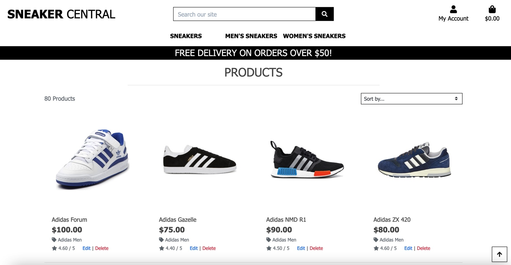

* As a visitor, I want to have the ability to sort products by price/rating/category:

Sort By dropdown works and correctly displays products in the order the user has selected

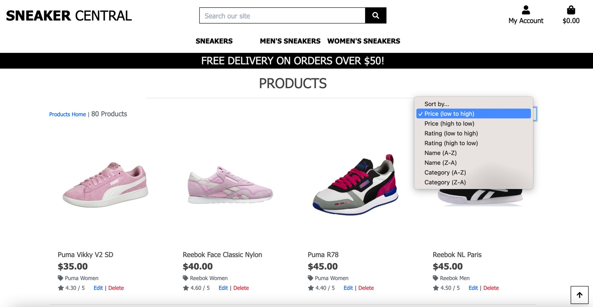

* As a visitor, I want to be able to search for different sneakers, so I can find specific sneakers quick and easy:

The Search bar can be used for searching by product name, brand or description

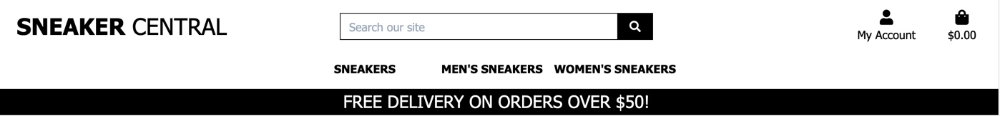

* As a visitor, I want to be able to view details about the sneakers (size, price, image, description), so I can see if the product suits my preferences:

Each product has a set product detail page. This shows all product information including available sizes, price, image and description of product.

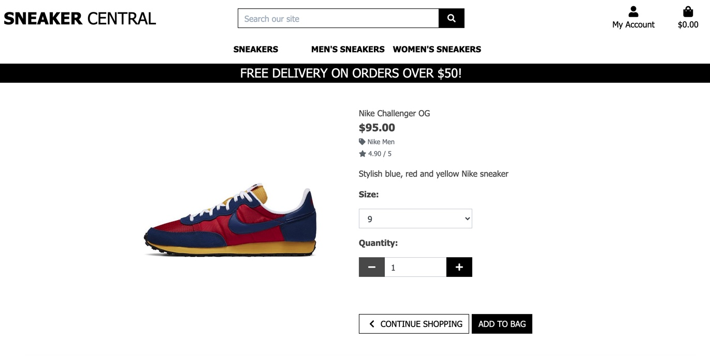

### Consumer goals:

* As a consumer, I want to add products to my bag, so I can buy products:

On the individual sneaker page, clicking ‘add to bag’ after choosing correct size and quantity will add the product to the basket.

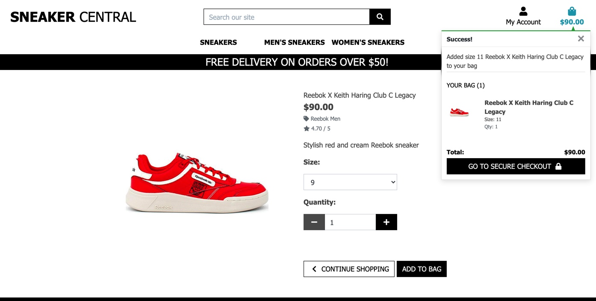

* As a consumer, I want to be able purchase products without an account:

Users are allowed to go through the entire site purchase process without the need for an account.

* As a consumer, I want to be able to delete products in my order, so I can remove products that I no longer wish to purchase:

In the Shopping Bag, the user can remove any products they do not wish to purchase from the order, by clicking ‘remove'. 

* As a consumer, I want to see the total price and shipping costs of my order, so I can see how much I have spent in total:

The total price and shipping costs are available to view in the Shopping Bag.

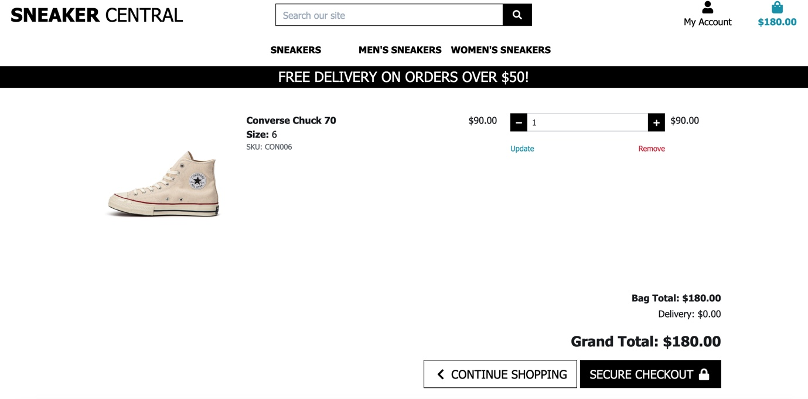

* As a consumer, I want to pay with a card in a safe and secure way, so I know that my payment goes well:

In Secure Checkout, the user can provide their details in a safe and secure way through the stripe payment system to complete their purchase 

* As a consumer, I want to receive a confirmation email of the order, so I know that the order is successfully received:

Consumers will receive a confirmation email of the order to the email address they provide in checkout

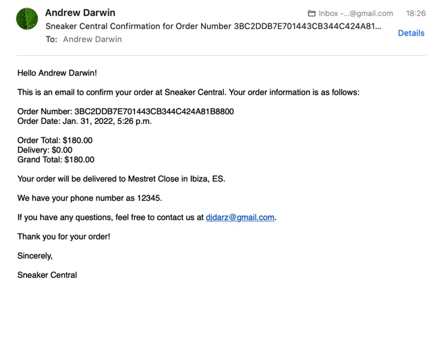

* As a consumer, I want to create an account, so I can see my profile details and order history:

Users can create an account easily and it takes very little time to set up a secure account

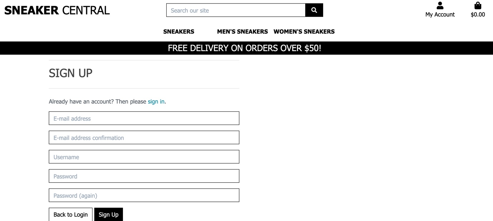

### Returning consumer goals:

* As a returning consumer, I want to securely login into my account quickly, so I can make an order quickly and so I can see my order history:

Log in process is quick and secure, and allows a user to save their log in details for next time

* As a returning consumer, I want to purchase products and have my order(s) saved to my profile:

All users, regardless of logged in status, will be able to purchase products through the site
If a user is logged in when they process an order, it will be displayed on their profile order history

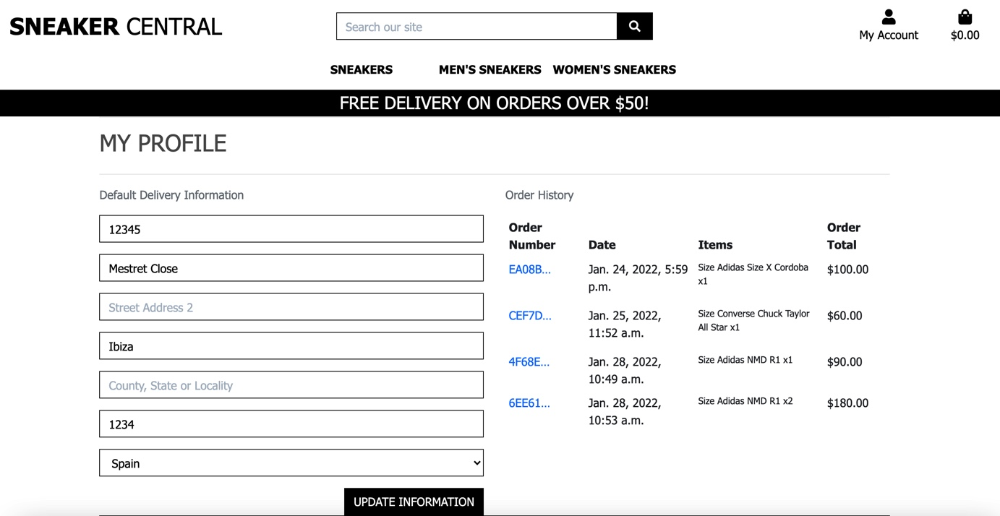

* As a returning consumer, I want to be able to view my past orders and order confirmations:

When a user is logged in, if they navigate to the my profile page they will be given their Order History. It will be a brief overview of the users past orders, but if they click on the order number it will take them to the order confirmation page

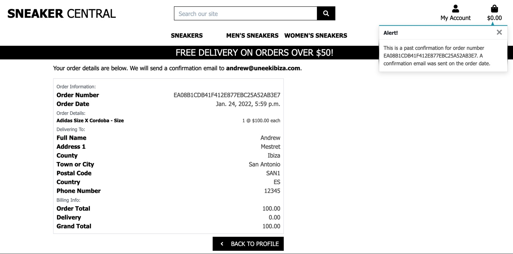

* As a returning consumer, I want to be able to leave reviews of products:

Logged in users are able to leave product reviews

### Site Owner/Admin goals:

* As admin, I want to provide a clean, simple e-commerce store so that users can easily find what they’re looking for:

I asked friends to use the site, and they were easily able to search for what they wanted, find from product lists what they wanted, and successfully purchase products

* As admin, I want to have the ability to add, edit/update and delete products:

Add, Edit/Update and Delete functions all work correctly with no errors. After editing, correct information is displayed on the site. Deleting a product deletes it from the site entirely, including reviews that have been left, and removing it from the admin view

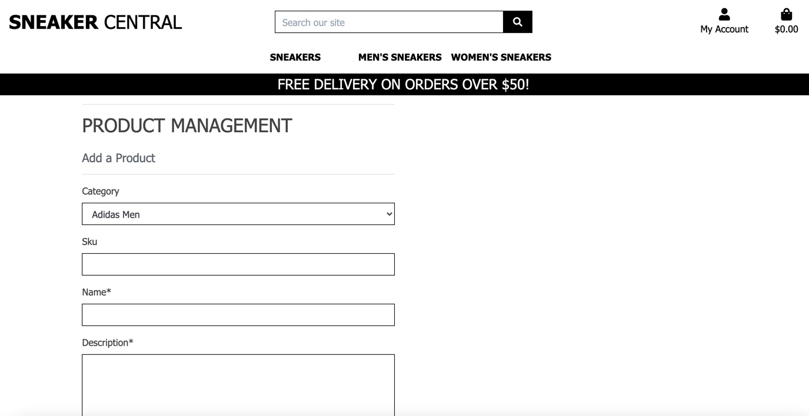

* As admin, I want to keep the site secure by only allowing authorised users to access certain areas of the site:

Full site authorisation has been implemented by using Djangos @login_required
This has been tested extensively to make sure no unauthorised access is given at any stage of the site

* As admin, I was to securely store user information in case an error occurs:

User information is stored securely using Django. Only information provided is kept, but does not include passwords for security reasons

# 5. Deployment

This application was developed using Gitpod, committed to Git and pushed to GitHub. Heroku is used to deploy this application. The GitHub repository is linked to the Heroku App via automatic deployment. Every time commits and pushes are sent to GitHub, the Heroku App is updated shortly after. Committing to GitHub is done as follow:
    
    git add .
    git commit -m "commit message"
    git push

## Heroku Deployment

This project was deployed through Heroku using the following steps:

* Creating Heroku App
* Log into Heroku
* Select 'Create New App' from your dashboard
* Choose an app name (if there has been an app made with that name, you will be informed and will need to choose an alternative)
* Select the appropriate region based on your location
* Click 'Create App'

### Connecting to GitHub

* From the dashboard, click the 'Deploy' tab towards the top of the screen
* From here, locate 'Deployment Method' and choose 'GitHub'
* From the search bar newly appeared, locate your repository by name
* When you have located the correct repository, click 'Connect'

### Environment Variables

* Click the 'Settings' tab towards the top of the page
* Locate the 'Config Vars' and click 'Reveal Config Vars'

The following variables all need to be added:

### Heroku Postgres Database

* Go to the resources tab in Heroku.
* In the Add-ons search bar look for Heroku Postgres & select it.
* Choose the Hobby Dev-Free option in plans.
* Click submit order form.
* Go back to the build environment and install 2 more requirements:

pip3 install dj_databse_url
pip3 install psycopg2-binary make sure to add these to the requirements file using pip3 freeze > requirements.txt

## Set up AWS

### AWS S3 Bucket

*  From the 'Services' tab on the AWS Management Console, search 'S3' and select it.
*  Click 'Create a new bucket', give it a name(associated with the Heroku app name), and choose the region closest to you.
*  Make sure that 'Block all public access' is unchecked(you may need to confirm that public access will be given).
*  Ignore any other settings that you are asked to change and click 'Create bucket'.
*  Open the created bucket, go to the 'Properties' tab and turn on static website hosting(fill in index.html and error.html as defaults) and click save.
*  Open the 'Permissions' tab, locate the CORS configuration section and add the following code:
[
  {
      "AllowedHeaders": [
          "Authorization"
      ],
      "AllowedMethods": [
          "GET"
      ],
      "AllowedOrigins": [
          "*"
      ],
      "ExposeHeaders": []
  }
]

*  In the 'Bucket Policy' section click 'Edit' > 'Policy Generator'.
*  Choose 'S3 Bucket Policy' from the 'Select Type of Policy' dropdown.
*  In 'Step 2: Add Statements', add the following settings:

*  Effect: Allow
*  Principal: " * " (no quotation marks)
*  Actions: GetObject
*  ARN: Bucket ARN (get from S3 Bucket page)
*  Click 'Add Statement'.
*  Click 'Generate Policy'.
*  Copy the policy from the popup that appears
*  Paste the generated policy into the Permissions > Bucket Policy area.
*  Add '/*' at the end of the 'Resource' key, and save.
*  Go to the 'Access Control List' section, and select 'List' next to 'Everyone'.

### AWS IAM (Identity and Access Management)

* From the 'Services' tab on the AWS Management Console, search IAM and select it.
* Go to 'User Groups' > 'Create New Group' > choose a name(associated with the S3 Bucket name) and click 'Create'.
* Go to 'Policies' > 'Create New Policy' > 'JSON' > 'Import Managed Policy' > search 'S3' > select 'AmazonS3FullAccess' > Click 'Import'.
* Get the bucket ARN from 'S3 Permissions'
* Delete the '*' from the 'Resource' key and add the following code into the area:
"Resource": [
    "{PASTED ARN}",
    "{PASTED ARN}/*"
]
* Click 'Next' > 'Review' > provide a name and description(associated with the S3 Bucket name), and click 'Create Policy'.
* Go to 'User Groups'> Open the created group > 'Permissions' > 'Add Permissions' > 'Attach Policies' > search for the policy you created and click 'Add Permissions'.
* Go to 'Users' > 'Add Users' > create a name and select 'Programmatic access' for the 'Access Type' option.
* Click 'Next' and select the group you created.
* Keep clicking 'Next' until you reach the 'Create user' button and click that.
* Download the CSV file which contains the AWS_SECRET_ACCESS_KEY and your AWS_ACCESS_KEY_ID needed in the Heroku variables.
* This will be the only time that you will be able to access and download this file. If you don't download it, you'll have to start the AWS process again

### Set up Emails

I used Gmail for the email account. I set it up as follows;

* Go to settings.py and change the DEFAULT_FROM_EMAIL to your chosen email address.
* If you want to set up a new Gmail account for the site, this is the time to do so.
* Go to the Gmail account and open the 'Settings' tab.
* Go to 'Accounts and Imports' > 'Other Google Account Settings'.
* Go to the 'Security' tab and open 'Signing in to Google'.
* Click on '2-step Verification', click 'Get Started' and turn on 2-step verification following their instructions.
* Go to 'Security' > 'Signing in to Google' > 'App Passwords'.
(You may have to input your account password again) Set 'App' to 'Mail', 'Device' to Other, and name it Django.
* The passcode that appears will be used in your Heroku variables.

### Forking the Repository

* Log in to GitHub and locate the GitHub Repository.
* At the top of the Repository above the "Settings" Button on the menu, locate the "Fork" Button.
* You will have a copy of the original repository in your GitHub account.
* You will now be able to make changes to the new version and keep the original safe.

### Making a Local Clone

* Log into GitHub.
* Locate the repository.
* Click the 'Code' dropdown above the file list.
* Copy the URL for the repository.
* Open Git Bash on your device.
* Change the current working directory to the location where you want the cloned directory.
* Type git clone in the CLI and then paste the URL you copied earlier. This is what it should look like:
git clone https://github.com/AndrewDarwin/sneaker_central  
* Press Enter to create your local clone.

You will need to install all of the packages listed in the requirements file you can use the following command in the terminal pip install -r requirements.txt which will do it for you.

# 6. Credits 

## Code

I followed the course walkthrough project "Boutique Ado" by Code Institute which helped me massively in setting up and helping to code my project. I liked the layout and general theme of this site, and retained similar characteristics, using it as inspiration.

## Images

* All product images were taken from external sources, and none of the images belong to me.

* All product photos are taken from https://sneakers123.com/en/sneaker/ 

* Home page hero image is taken from www.pexels.com

## Acknowledgements

* I would like to thank my mentor, Antonio Rodriguez for his guidance and feedback

* Tutor support for queries and issues I faced in this project

## Disclaimer!

* This website was developed for educational purposes only.
